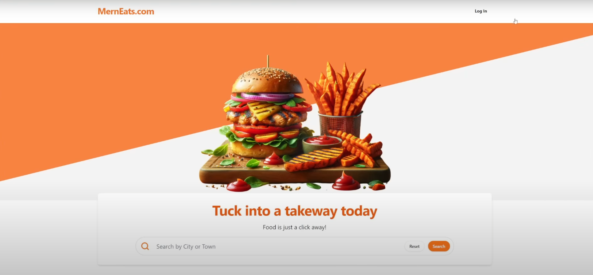

<div align="center">
 <br />
  <a href="https://www.youtube.com/watch?v=ardeKHEN1j4&t=44672s&ab_channel=ChrisBlakely" target="_blank"> 
  
   </a>
    <br />
     <div> <br />
      
     
       
       
      </div> 
      <h3 align="center">MERN Food Ordering App</h3>
       <div align="center"> A full-stack food ordering platform built with the MERN stack as part of Chris Blakely's "Enterprise-Level Food Ordering Platform" Youtube course.
        </div>
         </div>
        
<br>
<div align="center">
    <br><br>
    <a href="https://www.youtube.com/watch?v=ardeKHEN1j4&t=44672s&ab_channel=ChrisBlakely" target="_blank">Project Video</a>
    <br>
    <a href="https://github.com/chrisblakely01" target="_blank">Chris Blakely GitHub</a>
</div>
 <br>

 <div style="text-align: center; margin-top: 20px;">
    <table style="
        margin: 0 auto; 
        width: 80%;
        border-radius: 8px;
        border-collapse: collapse;
        box-shadow: 0 4px 12px rgba(0, 0, 0, 0.1);
        text-align: center;">
        <thead style="background-color: #336699; color: white;">
            <tr>
                <th style="padding: 15px; font-size: 15px; border-bottom: 2px solid #ddd;text-align: center;">Initiated</th>
                <th style="padding: 15px; font-size: 15px; border-bottom: 2px solid #ddd;text-align: center;">Completed</th>
                <th style="padding: 15px; font-size: 15px; border-bottom: 2px solid #ddd;text-align: center;">Progress - 29Dec24</th>
                <th style="padding: 15px; font-size: 15px; border-bottom: 2px solid #ddd;text-align: center;">YT video length</th>
            </tr>
        </thead>
        <tbody style="background-color: #f9f9f9;">
            <tr>
                <td style="padding: 12px; font-size: 16px; color: #336699; font-weight: bold; text-align: center;">December 2024</td>
                <td style="padding: 12px; font-size: 16px; color: #336699; font-weight: bold; text-align: center;">Est. ~ mid 2025</td>
                <td style="padding: 12px; font-size: 16px; color: #336699; font-weight: bold; text-align: center;">
                    <div style="background-color: #4caf50; width: 2px; height: 20px; border-radius: 10px; margin: 0 auto; text-align: center;"></div>
                    3%
                </td>
                <td style="padding: 12px; font-size: 16px; color: #336699; font-weight: bold; text-align: center;"> 16 hours </td>
            </tr>
        </tbody>
    </table>
</div>

## <a name="tech-stack">⚙️ Tech Stack</a>

Frontend:

- React (with Vite)
- TailwindCSS (for styling)
- Shadcn/UI components
- Auth0 (authentication)

Backend:

- Node.js (with Express.js)
- MongoDB (via Mongoose)
- Cloudinary (for image hosting)
- Stripe (payment processing)
<br><br>

## <a name="features">🔋 Features</a>
<br>

👉 **User Authentication:** Register/login using Auth0 for secure access.

👉 **Dynamic Menu Navigation:** Filter and sort menus based on restaurant or price.

👉 **Order Management:** Track order history and statuses via user profile.

👉 **Restaurant Management:** Restaurant owners can manage menus, cuisines and orders.

👉 **Checkout & Payments:**  Secure payments with Stripe integration.

👉 **Responsive Design:** Fully optimized for mobile and desktop devices.

👉 **Real-Time Updates:** Track order status in real-time with a sleek UI.

## <a name="quick-start">🤸 Quick Start</a>

Follow these steps to set up the project locally on your machine.

**Prerequisites**

Make sure you have the following installed on your machine:

- [Git](https://git-scm.com/)
- [Node.js](https://nodejs.org/en)
- [npm](https://www.npmjs.com/)
- [MongoDB](https://www.mongodb.com/)


**Cloning the Repository**

```bash
git clone https://github.com/r3ss1/food-ordering.git
```
Frontend and Backend are hosted in separate repositories. 
```bash
cd backend
```
<br>
 
```bash
cd frontend
```

**Installation**

Install the project dependencies using npm:

```bash
npm install
```

More details will be provided soon!🧑‍💻


## <a name="links">🔗 Links</a>

You can find important links below:

- <a href="https://ui.shadcn.com/docs/installation" target="_blank">React/Vite/Shadcn Installation</a>
- <a href="https://stripe.com/docs/testing#international-cards" target="_blank">Stripe Test Cards</a>
- <a href="https://stripe.com/docs/stripe-cli" target="_blank">Stripe CLI Documentation</a>
- <a href="https://auth0.com/" target="_blank">Auth0</a>
- <a href="https://stripe.com/" target="_blank">Stripe</a>
- <a href="https://cloudinary.com/" target="_blank">Cloudinary</a>
- <a href="https://mongodb.com" target="_blank">MongoDB</a>
- <a href="https://render.com" target="_blank">Render</a>

## <a name="assets">📦 Assets</a>

Assets used in the project can be
found [here](https://github.com/chrisblakely01/mern-food-ordering-app-course-resources)


## 🤝 Acknowledgments

Massive thanks to Chris Blakely for the tutorial and course resources!

 [Chris Blakely Youtube](https://www.youtube.com/@ChrisBlakely).

## 📄 License

This project is licensed under the MIT License.

Note: This project is for educational purposes and is free to use under the terms of the MIT License.

